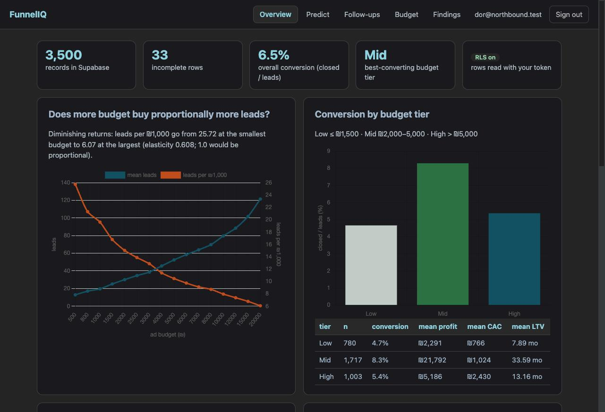
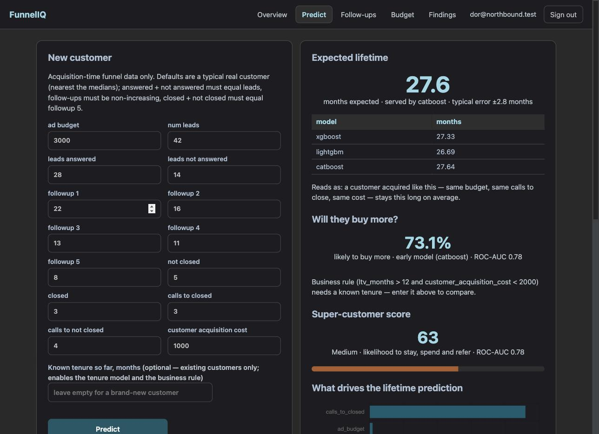
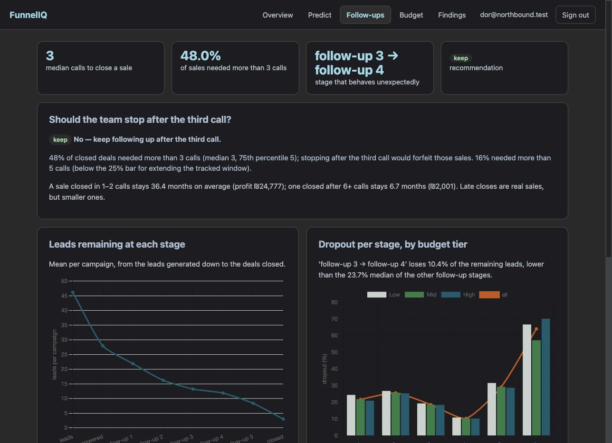
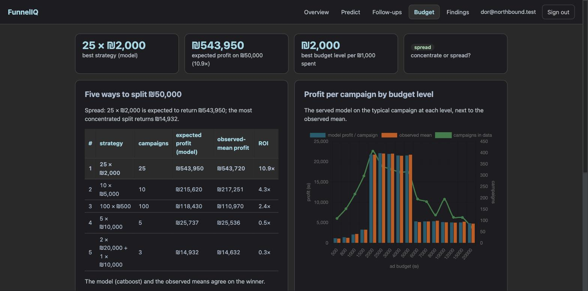

# FunnelIQ

[](https://github.com/DorKatzav/funneliq/actions/workflows/ci.yml)

Marketing-intelligence tool for Northbound Media, built from 3,500 historical campaigns. It predicts how
long a new customer will stay, whether they will buy more, and how likely they are to become a "super
customer"; it answers the sales manager's follow-up paradox with data; and it simulates how to split a
₪50,000 monthly ad budget. Login-gated internal tool: gradient boosting (XGBoost, LightGBM, CatBoost),
FastAPI, Supabase (Postgres + Auth + Row Level Security), Railway.

> **Live:** https://funneliq-production-4b63.up.railway.app (health: `/health`) · **Status:** M8 — complete, all six packages live.
> The founder's write-up is `docs/REPORT.md` (executive summary at the top); the Hebrew milestone reports are in `docs/reports/`.

## What it answers

| # | Question from the brief | Answer (from the data) | Where |
| --- | --- | --- | --- |
| P1 | Is the data clean? Does more budget buy proportionally more leads? Which tier converts best? | 33 incomplete rows, never imputed. Diminishing returns (elasticity 0.61). Mid tier (₪2,000–5,000) converts best, 8.3%, with ~4× the profit of large campaigns | `docs/FINDINGS.md`, Overview tab |
| P2 | How long will a new customer stay? | R² 0.95, ±2.8 months. Calls-to-close is the lever: 1–2 calls ≈ 36 months, 6+ ≈ 7 | Predict tab, `REPORT.md §P2` |
| P3 | Who is likely to buy more? | Model ROC-AUC 0.80; for existing customers the rule "tenure > 12 and CAC < ₪2,000" is as good (F1 0.786 vs 0.771) | Predict + Findings tabs, `§P3` |
| P4 | Who becomes a super customer? | 17% of customers = 34% of profit, cheaper to acquire (₪991 vs ₪1,527); nearly all Mid-tier and closed in ≤ 2 calls. 0–100 score live | Predict + Findings tabs, `§P4` |
| P5 | Is the team wasting time after the third call? | No: 48% of sales needed > 3 calls. The odd stage is follow-up 3→4 (10% dropout vs 24%). Late closes are small accounts | Follow-ups tab, `§P5` |
| P6 | Concentrate or spread ₪50,000? | Spread across Mid-tier campaigns: 25 × ₪2,000 → ₪544k expected (10.9×) vs ₪15k for 2 × ₪20,000 + ₪10,000 | Budget tab, `§P6` |

Every number in the reports is generated by code from `models/metrics.json`, `docs/FINDINGS.md` and the
simulator — never typed by hand.

## Architecture

```text
browser ── static/login.html + dashboard.html (vanilla JS, Chart.js, supabase-js with the PUBLIC anon key)
   │  signs in with Supabase Auth, then sends  Authorization: Bearer <user JWT>  to the API
   ▼
FastAPI on Railway (app/)
   ├── app/auth.py        verifies the JWT (ES256 via JWKS, HS256 fallback; role must be "authenticated")
   ├── app/db.py          builds a Supabase client bound to the USER'S token → Postgres enforces RLS
   ├── /api/records       the raw rows (paginated)
   ├── /api/insights/*    overview · followups · super-customers  — computed from Supabase rows at runtime, cached 10 min
   ├── /api/predict/*     ltv · upsell · super-score  — models/*.joblib, every call logged to prediction_log
   ├── /api/simulate/*    presets · budget  — profit model + models/profiles.json, no database needed
   └── /health            version, commit, models loaded
   ▲
ml/ (trained offline, artifacts committed)      Supabase (Postgres + Auth + RLS)
   data.py → features.py (leakage guard) →       funnel_records (3,500 rows), prediction_log
   train_ltv / train_upsell / train_super /      policies: authenticated users read all rows,
   train_profit → models/*.joblib, metrics.json  each user sees only their own predictions
GitHub push → Actions (ruff + pytest) → Railway watches main → redeploy → /health shows the commit
```

Design decisions D1–D10 are in `DESIGN_HE.html`; the implementation plan, contracts and gates in `PLAN.md`;
every decision made along the way (`D-M<milestone>-<n>`) in `PROJECT_LOG.md`.

**Feature policy.** Models see only acquisition-time funnel data (14 raw columns + 4 engineered). Outcome columns
(lifetime, purchase, upsell, profit, referral) are never features for another outcome; the single sanctioned
exception (tenure for the upsell-tenure variant) is justified in `REPORT.md §P3` and enforced by
`ml/features.py::assert_no_leakage`, which is a test, not a comment.

## Local setup

```bash
conda activate AI_dev                 # or any Python 3.11 env
pip install -r requirements.txt
cp .env.example .env                  # Supabase URL + anon key; service key ONLY locally, for the loader
uvicorn app.main:app --reload         # http://127.0.0.1:8000  (OpenAPI docs at /api/docs)
pytest -q && ruff check .
```

- macOS: `lightgbm` / `xgboost` need `brew install libomp`.
- Railway builds with **Railpack**; the start command and `libgomp1` live in `railpack.json` (and `railway.json`).
- Supabase: run `db/schema.sql` then `db/policies.sql` in the SQL editor (the editor runs only the highlighted
  selection — verify with the count query at the bottom of `policies.sql`). Self sign-up is disabled; team users
  are created by hand in the Auth panel.

## Data and retraining

```bash
python scripts/load_data.py           # CSV → Supabase, idempotent (needs SUPABASE_SERVICE_KEY locally)
python scripts/train_all.py           # everything below, in order
python -m ml.eda --write docs/FINDINGS.md   # P1 findings note
python -m ml.train_ltv                # P2: three regressors + leakage ablation -> models/ltv_*.joblib
python -m ml.train_upsell             # P3: early / tenure variants, baseline, business rule -> models/upsell_*.joblib
python -m ml.train_super              # P4: 18-config CatBoost search, profile -> models/super.joblib
python -m ml.followups --write-report  # P5: dropout table + recommendation -> REPORT.md §P5
python -m ml.train_profit             # P6: profit model -> models/profit.joblib + profiles.json
python -m ml.simulator --write-report  # P6: rank the ₪50,000 presets -> REPORT.md §P6
python -m ml.stats                    # input statistics for the "far from training data" warning
python scripts/gate.py --m 8          # milestone gate (M8 re-runs every earlier offline check)
python scripts/smoke_live.py          # live end-to-end sanity sweep
```

Artifacts are committed on purpose (design decision D2): the API loads `models/` at startup, so a deploy is
deterministic and every retrain is a reviewable diff.

## Screenshots

| | |
| --- | --- |
|  Overview: KPIs, budget → leads, conversion by tier |  Predict: lifetime, upsell, 0–100 super score |
|  Follow-ups: verdict, dropout by stage, calls to close |  Budget: five strategies ranked, profit curve, free builder |

## Security model

- The browser holds only the **public anon key**; every API call carries the signed-in user's JWT.
- The API verifies the JWT and queries Supabase **with that token**, so Row Level Security is enforced by
  Postgres, not by application code. Anon without a JWT sees 0 rows; a signed-in user sees 3,500.
- The **service-role key** exists only in the local `.env` for `scripts/load_data.py`. It is never set on
  Railway and never committed (`scripts/gate.py` scans the tree for key material before every milestone).
- `prediction_log` rows are visible only to the user who created them.

## Repository map

| Path | What |
| --- | --- |
| `app/` | FastAPI service: `config.py`, `auth.py`, `db.py`, `schemas.py`, `routers/` (records, insights, predict, simulate) |
| `ml/` | `data.py`, `features.py` (policy + leakage guard), `evaluate.py`, trainers, `followups.py`, `simulator.py`, `stats.py`, `registry.py` |
| `models/` | committed artifacts: `*.joblib`, `metrics.json`, `profiles.json`, `input_stats.json` |
| `static/` | `login.html`, `dashboard.html`, `app.js`, `styles.css` |
| `scripts/` | `load_data.py`, `train_all.py`, `gate.py`, `smoke_live.py` |
| `db/` | `schema.sql`, `policies.sql` |
| `docs/` | `FINDINGS.md`, `REPORT.md`, `STRANGER_TEST.md`, `reports/M0_HE.html … M8_HE.html` (Hebrew), `notes/` |
| `data/` | the provided dataset (3,500 rows, never modified) |
| `tests/` | 90+ tests: data, features/leakage, auth, API, insights, predictions, follow-ups, simulator |

## Credits

Brief and dataset: course assignment "FunnelIQ — Self-Directed Project Brief" (Northbound Media is fictional).
Built by Dor Katzav with Claude Code. Stack: FastAPI, Supabase, Railway, XGBoost, LightGBM, CatBoost,
scikit-learn, pandas, Chart.js.
